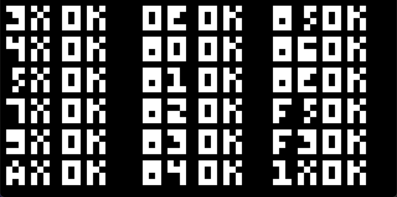

# CHIP-8

An implementation of Austin Morlan's [CHIP-8 emulator](https://austinmorlan.com/posts/chip8_emulator/).

## Build

To build and run, first make sure you have SDL installed on your system, clone the repository and configure CMake in the directory. 

You should now be able to build the project; the executable takes three mandatory command-line arguments in the form `CHIP_8.exe <Scale> <Delay> <ROM>`, where:

* `<Scale>` is the scale factor by which to multiply the 64x32 screen of the CHIP-8;
* `<Delay>` is the time, in microseconds, between each cycle of the CHIP-8;
* And `<ROM>` is the path to the CHIP-8 program file to run (you can find a pretty big collection of CHIP-8 ROMs to test [here](https://github.com/dmatlack/chip8/tree/master/roms)).